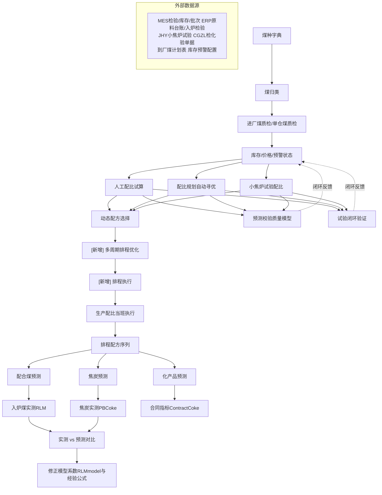
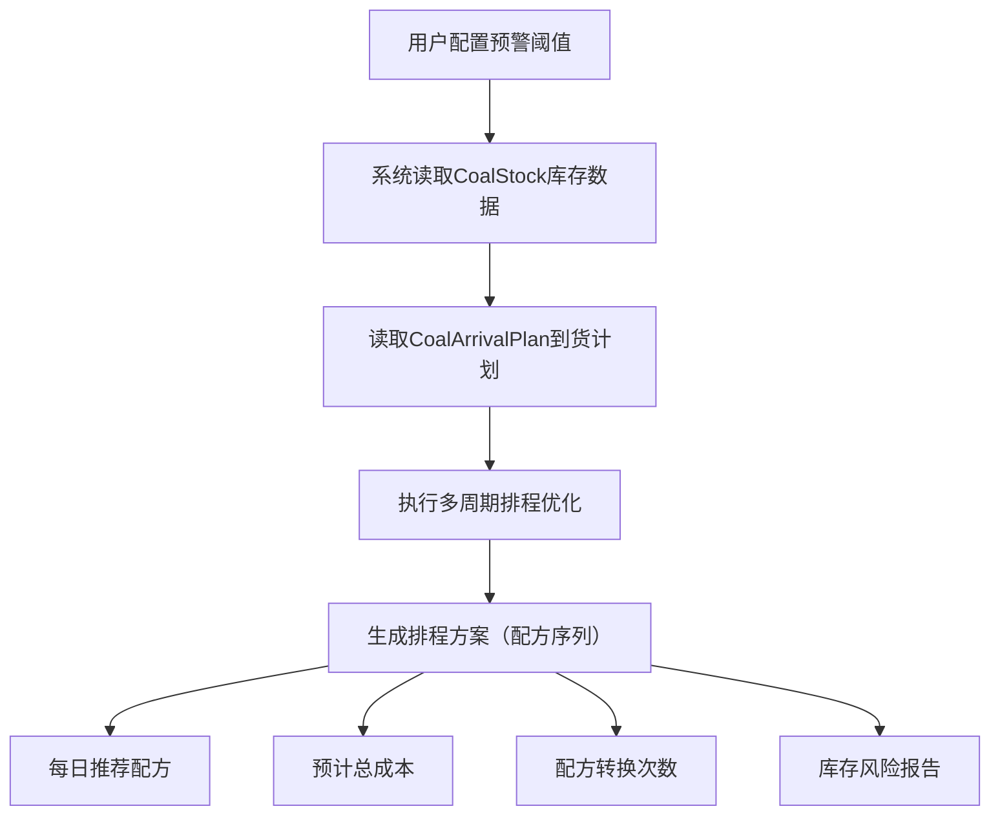

# 配煤专家2.0

## 1 系统定位与总体设计

### 1.1 系统目标

本系统是焦化厂配煤生产的决策支持与数据管理平台，围绕"以销定配、以配保质"的核心业务，在原三大目标基础上新增第四大目标：

1. **数据集中管理**：统一维护煤种字典、进厂煤质检、单仓煤质检、库存、价格、焦炭质检等配煤相关数据，打通与 MES、ERP（计划一体化/原料台账）、CGZL（采购质量）等外部系统的数据通道。
2. **质量预测**：基于煤质指标与经验数学模型，推算配合煤 → 焦炭 → 化产品的质量指标，使配比方案在投产前即可预知效果。
3. **配比优化**：在满足焦炭合同质量指标的约束下，自动搜索收益最大的配煤方案，并建立"预测 ↔ 实测"闭环以持续修正模型。
4. **生产排程优化**：集成库存预警与到货计划，实现多周期配煤排程，平衡成本最小化与配方转换最小化的双目标优化。

### 1.2 业务全景（升级版）



### 1.3 数据分布扩展

| 数据域 | 存储位置 | 说明 |
| ---- | ---- | ---- |
| 业务主数据（煤种、质检、配比、预测、用户权限） | SQL Server DB_Coke | 系统自维护 |
| 检验原始数据（进厂煤、配合煤、焦炭检验委托与分析值） | Oracle MES | 只读集成 |
| 原料台账（进厂/入炉煤质检视图、焦炭检验视图） | SQL Server ERP 视图 | 只读集成 |
| 排程配置（预警阈值、转换代价系数） | SQL Server DB_Coke | 新增表：ScheduleConfig |
| 到货计划（煤名+日期+数量） | SQL Server DB_Coke | 新增表：CoalArrivalPlan |
| 排程历史（日期+配方+成本+转换标记） | SQL Server DB_Coke | 新增表：ScheduleHistory |

## 2 排程模块核心功能设计

### 2.1 库存预警系统

#### 2.1.1 预警线配置

支持按煤种设置多级预警阈值（预警线、紧急线）：

- **预警线**默认值：3天平均消耗量
- **紧急线**默认值：1天消耗量

#### 2.1.2 预警状态管理

```python
class InventoryWarningSystem:
    """
    库存预警系统，解决原系统"配比规划不校验库存"的问题
    """
    WARNING_LEVELS = {
        "NORMAL": "正常",      # 库存 > 预警线
        "WARNING": "预警",     # 紧急线 < 库存 ≤ 预警线
        "CRITICAL": "紧急"     # 库存 ≤ 紧急线
    }
```

### 2.2 多目标排程优化

#### 2.2.1 优化目标

1. **成本最小化**：总配煤成本 = Σ(每日配方成本 × 日需求量)
2. **配方转换最小化**：转换次数 = Σ(相邻日配方不同 ? 1 : 0)
3. **库存风险最小化**：风险评分 = Σ(每日各煤种库存状态权重)

#### 2.2.2 优化算法

采用滚动时域优化（Rolling Horizon Optimization）：

```python
class SchedulingOptimizer:
    def optimize_rolling_horizon(self, horizon_days: int, step_days: int):
        """
        滚动时域优化
        :param horizon_days: 优化时域长度
        :param step_days: 滚动步长
        """
        schedule = []
        for start_day in range(0, total_days, step_days):
            # 获取当前库存和未来到货
            current_inventory = self.get_inventory(start_day)
            arrival_plan = self.get_arrival_plan(start_day, horizon_days)

            # 多目标优化
            partial_schedule = self.multi_objective_optimize(
                start_day=start_day,
                horizon=horizon_days,
                inventory=current_inventory,
                arrivals=arrival_plan
            )

            # 采用第一步决策，滚动到下一时段
            schedule.extend(partial_schedule[:step_days])
```

### 2.3 配方转换管理

#### 2.3.1 转换代价量化

- **设备调整成本**：焦炉参数重新设定所需时间成本
- **质量波动风险**：配方转换初期焦炭质量不稳定性
- **操作复杂度**：操作工对新配方的熟悉程度

#### 2.3.2 相似度评估

```python
def formula_similarity(formula1, formula2):
    """
    计算两个配方的相似度
    相似度 = 1 - Σ|ratio1_i - ratio2_i| / 200
    """
    total_diff = sum(abs(r1 - r2) for r1, r2 in zip(formula1.ratios, formula2.ratios))
    return 1 - total_diff / 200  # 最大差异200（100+100）
```

## 3 数学模型扩展

### 3.1 多目标优化框架升级

在原加权法基础上扩展多目标处理能力：

$$
\min F = \lambda_1 \cdot J + \lambda_2 \cdot (-M_{40\_reg}) + \lambda_3 \cdot M_{10\_reg} + \lambda_4 \cdot (-CSR_{reg}) + \lambda_5 \cdot C + \lambda_6 \cdot T
$$

其中：

- $C$：总配煤成本（新增目标）
- $T$：配方转换代价（新增目标）
- $\lambda_1 \sim \lambda_6$：权重系数，满足 $\sum\lambda_i = 1$

### 3.2 库存约束集成

解决原系统"配比规划不校验库存"的问题：

$$
\sum_{t=1}^{T} w_{i,t} \times D_t \leq S_{i,0} + \sum_{\tau=1}^{t} A_{i,\tau} - \sum_{\tau=1}^{t-1} w_{i,\tau} \times D_\tau
$$

符号说明：

- $w_{i,t}$：煤种i在第t天的配比（%）
- $D_t$：第t天的配合煤需求量（吨）
- $S_{i,0}$：煤种i的初始库存（吨）
- $A_{i,\tau}$：煤种i在第τ天的到货量（吨）

### 3.3 预警约束

$$
\begin{cases}
\text{if } S_{i,t} \leq \theta_{i,\text{warning}} \\
w_{i,t+1} \leq \rho \times w_{i,t}
\end{cases}
$$

- $\theta_{i,\text{warning}}$：煤种i的预警线阈值
- $\rho$：用量增长限制系数（默认0.8）

## 4 接口设计

### 4.1 外部系统接口

| 接口类型 | 数据内容 | 频率 | 备注 |
| ---- | ---- | ---- | ---- |
| MES库存接口 | 实时库存量 | 每小时 | 用于库存预警 |
| ERP到货计划 | 未来到货计划 | 每日 | 用于排程优化 |
| 采购系统接口 | 采购订单状态 | 每日 | 用于紧急采购决策 |

### 4.2 内部数据流



## 5 约束条件扩展

### 5.1 新增约束类型

1. **库存可持续性约束**：确保配方在整个排程期内可持续执行
2. **配方平滑约束**：限制相邻日配方间的剧烈变化
3. **预警响应约束**：当库存低于预警线时，自动调整配方

### 5.2 约束优先级

| 优先级 | 约束类型 | 说明 |
| ---- | ---- | ---- |
| 1 | 焦炭质量达标 | 必须满足合同指标 |
| 2 | 库存可行性 | 配方所需煤量 ≤ 可用库存 |
| 3 | 配方平滑性 | 限制频繁配方转换 |
| 4 | 成本优化 | 在满足上述约束下最小化成本 |

## 6 实施计划

### 6.1 第一阶段：基础功能

1. 扩展数据库表结构（新增ScheduleConfig、CoalArrivalPlan、ScheduleHistory）
2. 实现库存预警模块
3. 集成到货计划数据接口

### 6.2 第二阶段：优化算法

1. 实现多目标排程优化算法
2. 开发配方相似度评估模块
3. 建立滚动时域优化框架

### 6.3 第三阶段：系统集成

1. 与现有配比优化模块集成
2. 开发排程可视化界面
3. 实现排程执行监控功能

## 7 预期效益

### 7.1 直接效益

- **成本降低**：通过优化煤种使用和减少紧急采购，预计降低配煤成本3-5%
- **生产稳定**：减少因缺料导致的停产或紧急配方转换
- **库存优化**：保持合理库存水平，减少资金占用15-20%

### 7.2 间接效益

- **决策支持**：为生产计划提供数据驱动的决策依据
- **风险预警**：提前识别库存风险，有时间采取应对措施
- **操作简化**：减少操作工频繁调整配方的工作量

## 8 技术实现要点

1. **避免硬编码**：所有预警阈值、转换代价系数等参数均从数据库读取，避免硬编码。
2. **安全约束处理**：按照企业安全规范处理用户密码和连接配置，解决原系统存在的安全约束问题。
3. **性能优化**：针对"候选煤多、区间宽时计算量指数增长"的问题，采用启发式算法和滚动优化策略，控制计算复杂度。

## 版本记录

- **V1.0**：基础配煤专家系统（已实现）
- **V2.0**：集成排程模块（本版本）

## 未来规划

强化学习优化、智能采购推荐、供应链协同优化
